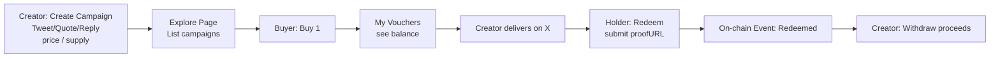

# IPIPO
Influence Pre-sale, Influence Public Offering for Individuals.

## Zero Idea

[两年前的一次高空脑洞，关于主权个人、关于 Web3 ](https://x.com/cellinlab/status/1755187529656258608?s=46)

## IPIPO — X Presale Vouchers (Tweet / Quote / Reply) on Monad

> Sell tomorrow’s attention, today.
>
> **IPIPO** 让创作者把一次在 **X / Twitter** 上的曝光服务（**Tweet / Quote / Reply**）铸造成 **可购买、可转让、可核销** 的链上服务券（ERC‑1155）。供给、销量、持有者、核销记录全部透明可查。

---

## 1) 项目简介（What / Why）

* **What**：创作者创建“推广活动”（Campaign），设定类型（Tweet/Quote/Reply）、单价与总量；买家购买得到**券**；交付完成后，持券人提交 **proofURL**（X 链接）进行**核销**，合约 **burn 1** 防止二次使用；创作者按活动维度**提现**。
* **Why**：

  * 低粉阶段即可获得现金流；
  * 早期支持者以更低成本锁定未来曝光；
  * 全链路上链，**避免超发**、降低信息不对称（谁买了、买了多少、还剩多少一目了然）。
* **定位**：本项目发行的是**服务券（coupon / voucher）**，**非证券**，无分红/收益承诺；交付物是一次具体的 X 曝光服务。

---

## 2) MVP 功能（Features）

### 2.1 覆盖范围

* 仅支持 **X 三类权益**：

  1. **Tweet**（发一条推）
  2. **Quote**（引用转推）
  3. **Reply**（回复/楼中楼）

### 2.2 基础能力

* **活动创建**：类型、单价、（可选）线性加价 `priceStep`、总量 `supply`、暂停 `paused`。
* **购买**：读取 `currentPrice(id)`，按原生代币支付，得到 **ERC‑1155** 代币（`tokenId = campaignId`）。
* **核销**：持券人提交 `proofURL`（X 上的实际交付链接），合约 `burn(1)` 并 `emit Redeemed` 事件，链上留痕。
* **提现**：创作者按活动维度提取 `proceeds[id]`。
* **透明度面板**：

  * 供给：`supply`；已售：`sold`；**超发检查**：对照 `sold ≤ supply`；
  * **持有者列表（Holders）**：由前端扫描 `TransferSingle/TransferBatch` 事件**计算**当前余额（支持二级转账后的最新持有者）。
* **潜力证明（Showcase）**：在 `metaURI` 中展示：

  * 创作者 **X 个人页**链接（`external_url`），
  * 一条 **高互动历史推文**链接（`attributes[].value`），用于参考其影响力。

### 2.3 非目标（MVP）

* 不抓取/校验外部数据（无爬虫/预言机）；
* 不提供仲裁系统；
* 不做多平台支持（仅 X）；
* 不依赖中心化后端（**纯前端 + 链上**）。

---

## 3) 架构（Architecture）

### 3.1 On-chain（Solidity / Foundry）

* **标准**：ERC‑1155（OpenZeppelin）。
* **存储**：

  ```solidity
  struct Campaign {
    address creator;
    uint256 basePrice;   // 初始价格（wei）
    uint256 priceStep;   // 线性加价步长（wei），MVP 可为 0
    uint32  supply;      // 总供给上限
    uint32  sold;        // 已售数量
    bool    paused;      // 是否暂停销售
    uint8   kind;        // 0: Tweet, 1: Quote, 2: Reply
  }

  mapping(uint256 => Campaign) public campaigns;
  mapping(uint256 => uint256) public proceeds; // 活动维度累计收入
  mapping(uint256 => string)  public metaURI;  // 指向 data: 或 ipfs:// 的 JSON
  uint256 public nextCampaignId;               // 自增 id
  ```
* **事件**：

  ```solidity
  event CampaignCreated(uint256 indexed id, address indexed creator, uint8 kind,
                        uint256 basePrice, uint256 priceStep, uint32 supply);
  event Purchased(uint256 indexed id, address indexed buyer,
                  uint256 amount, uint256 unitPrice, uint256 totalPaid);
  event Redeemed(uint256 indexed id, address indexed redeemer, string proofURI);
  event Withdrawn(uint256 indexed id, address indexed creator, uint256 amount);
  event MetaURISet(uint256 indexed id, string uri);
  ```
* **核心方法（签名）**：

  ```solidity
  function createCampaign(uint8 kind, uint256 basePrice, uint256 priceStep, uint32 supply)
    external returns (uint256 id);
  function currentPrice(uint256 id) public view returns (uint256);
  function buy(uint256 id, uint256 amount) external payable;  // mint & sold++ & proceeds+=
  function redeem(uint256 id, string calldata proofURI) external; // require balance>=1; burn(1)
  function withdraw(uint256 id) external;                    // only creator
  function setPaused(uint256 id, bool p) external;           // only creator
  function setMetaURI(uint256 id, string calldata uri) external; // only creator
  function uri(uint256 id) public view override returns (string memory); // 返回 metaURI[id]
  ```
* **Meta JSON（示例）**：

  ```json
  {
    "name": "IPIPO #12 — Tweet",
    "description": "One Tweet from @your_handle within 7 days after coordination.",
    "external_url": "https://x.com/your_handle",
    "image": "ipfs://.../banner.png",
    "attributes": [
      {"trait_type": "Kind", "value": "Tweet"},
      {"trait_type": "SLA",  "value": "Deliver within 7 days after DM."},
      {"trait_type": "Showcase", "value": "https://x.com/.../status/12345"}
    ]
  }
  ```

### 3.2 Frontend（Vite + React + Tailwind + DaisyUI + wagmi/viem + RainbowKit）

* **页面**：

  * **Explore**：活动卡片（类型、当前价、已售/总量、Buy）。
  * **Campaign Detail**（可与卡片合并）：展示 `metaURI`（X 主页 & Showcase 链接）。
  * **My Vouchers**：当前地址在各活动的持有数量；支持 **Redeem**（输入 `proofURL`）。
  * **Creator Dashboard**：`createCampaign / setMetaURI / setPaused / withdraw`。
* **Holders 列表实现**：
  使用 `viem` 的 `getLogs` 从部署区块开始抓 `TransferSingle/Batch`，在前端累加/相减计算余额：

  ```ts
  import { parseAbiItem } from 'viem'
  const transferSingle = parseAbiItem(
    'event TransferSingle(address operator, address from, address to, uint256 id, uint256 value)'
  )
  const logs = await client.getLogs({
    address: CONTRACT,
    event: transferSingle,
    fromBlock: DEPLOY_BLOCK,
    toBlock: 'latest',
    args: { id }
  })
  const ZERO = '0x0000000000000000000000000000000000000000'
  const bal = new Map<string, bigint>()
  for (const l of logs) {
    const { from, to, value } = l.args as any
    if (from !== ZERO) bal.set(from, (bal.get(from) ?? 0n) - BigInt(value))
    if (to   !== ZERO) bal.set(to,   (bal.get(to)   ?? 0n) + BigInt(value))
  }
  const holders = [...bal].filter(([,v]) => v > 0n)
  ```

---

## 4) 交互流程（User Flow）



---

## 5) 快速开始（Quickstart）

### 5.1 先准备

* **Node.js 18+**、**pnpm / npm / yarn**、**Foundry**、**兼容 EVM 的钱包**（MetaMask / Rabby）。

### 5.2 领取 Monad 测试币（Faucet）

1. 打开：`https://faucet.openbuild.xyz/monad`
2. **连接钱包**；若提示添加/切换到 **Monad Testnet**，请确认。
3. 按页面提示（验证码/登录）**领取测试币**（MON 之类的原生代币）。
4. 钱包切到 **Monad Testnet**，稍等片刻看到余额变化即可。
5. 可用 Foundry 校验余额：

   ```bash
   cast balance 0xYourAddress --rpc-url $RPC_URL
   ```

> 如果页面未自动添加网络，请在钱包里手动添加：
>
> * **Network Name**: Monad Testnet（示例）
> * **RPC URL**: `<your-monad-testnet-rpc>`
> * **Chain ID**: `<your-chain-id>`
> * **Currency Symbol**: `MON`

（以上具体参数以黑客松/官方提供为准）

### 5.3 部署合约（Foundry）

```bash
# 配置 .env: PRIVATE_KEY, RPC_URL
forge build
forge script script/Deploy.s.sol:Deploy --rpc-url $RPC_URL --broadcast
```

* 记录 **合约地址** 与 **部署区块高度**（前端扫描事件需要）。

### 5.4 启动前端

* 前端 `.env`：

  ```env
  VITE_WC_PROJECT_ID=...               # WalletConnect 项目 ID（RainbowKit 用）
  VITE_RPC_URL=...                     # Monad Testnet RPC
  VITE_CHAIN_ID=...                    # Monad Testnet ChainId
  VITE_CHAIN_NAME=Monad Testnet
  VITE_CONTRACT_ADDRESS=0x...          # 上一步的合约地址
  VITE_DEPLOY_BLOCK=123456             # 部署区块高度
  ```
* 安装 & 运行：

  ```bash
  pnpm i
  pnpm dev
  ```

---

## 6) 合规模块（Compliance）

* 本项目发行的是**服务券**，**不是证券**；
* 无任何分红或收益承诺；
* 交付物是一次具体的 X 曝光服务；
* 提供 **总量上限**、**暂停销售**、**已售统计**、**持有者列表** 等透明度工具，便于买家自查。

---

## 7) Roadmap（摘录）

* 线性加价 `priceStep` / 其他价格曲线；
* `redeemRequest` + `confirmDelivered` 双向确认；
* 信誉指标（兑付率、平均交付时长）；
* 二级市场页（仅前端聚合，不托管资产）；
* `metaURI` 切换到 IPFS；
* 多平台支持（小红书 / YouTube / 博客赞助等）。

---

## 8) License

MIT

---
